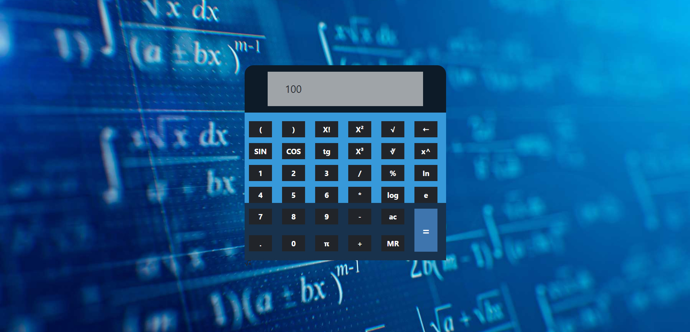
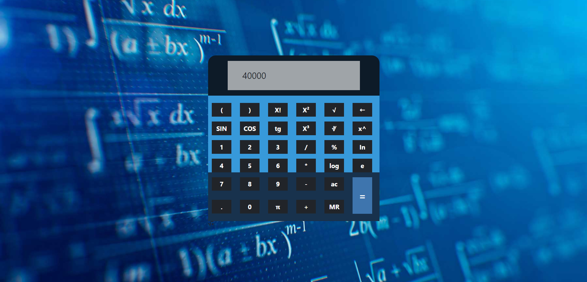
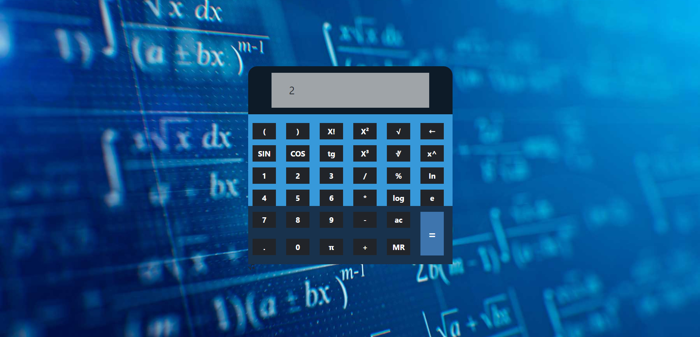

link github pages: https://diegodelias.github.io/calculadoraReactCodoaCodo2022/

Funcionan operaciones basicas : suma , resta, multiplicacion , potencia de 2 , potencia de 3 , raiz cuadrada , raiz cubica
Funciona teclas: sin, cos ,tg , log , ac , borrado (🠠)  , π

